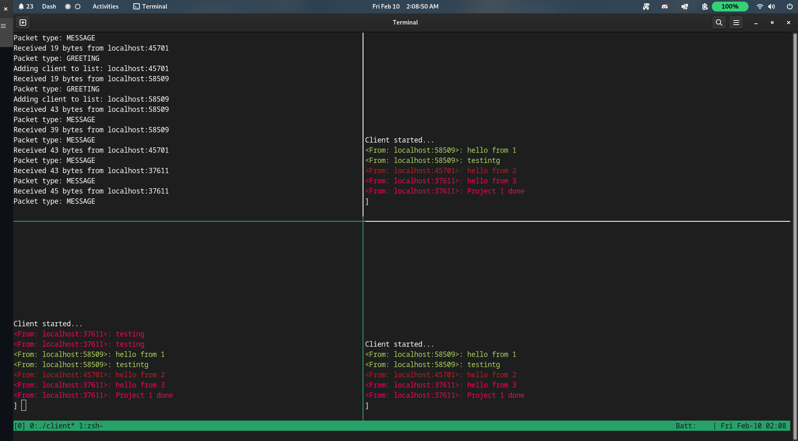

# Project 1: Network Chat Application

This is my implementation of the network chat application assigned in programming project 1. 




### Description and Features 

Both the server and client applications were written in C++ using the 2020 standard. Most of the code could be ported directly to C, but
I didn't want to write a hashmap in C for the server application. The standard POSIX socket library to complete the assigned
 task. I referenced the man pages for pretty much everything related to the sockets themselves.

Nothing particularly clever is done on the server-side of my implementation. It just waits until it receives input from the socket,
and then handles the data appropriatly. 

For the client, I utilized the `select` POSIX systemcall to allow both the socket and the `stdin` to be polled for incoming data 
at the same time without waiting for read timeouts. Using this systemcall also allows for the program to sleep until an incoming 
change is detected on either the socket or `stdin`, thus reducing cpu load.

Various work was done to make the client function better. Various terminal control tricks were done to make the output look nicer.
When a user inputs data, the users input is removed from the terminal once entered and only prints the message when it is received back from the 
server. This allows for a more uniform look between messages. Additionally, this design choice makes it easier to figure out if your messages 
are being received by the server or not (if you don't get your own message back, you probably aren't connected). I also implemented a feature 
that provides each client a separate color within the chat. This is implemented on the client side by hashing the origin (string of concatenated host and port) of the 
sending and mapping the hash to a terminal color. This works with terminals that support 8-bit colors, not sure how this will turn out on 
terminals with fewer colors, but should be fine (all modern terminal emulators should support this). Incoming messages also trigger
the terminal bell if you have it enabled. 

I used [this guide on ANSI escape codes](https://gist.github.com/fnky/458719343aabd01cfb17a3a4f7296797) to implement these features.

#### Message format

A classmate and I standardized our packet formats via the use of JSON in order to allow our servers/clients to
be compatible with one another (which was successful). That was the extent of our collaboration. JSON was chosen because we wrote
our clients/servers in different languages and figured it's best to use a data format that is friendly to all languages.

These are the packet formats in JSON below:
```json 
{"type":"GREETING"}
{"type":"MESSAGE", "message": "Message text."}
{"type": "INCOMING", "message": "Message text.", "origin": "127.0.0.1:9999"}
```

### My System

| Property | Value |
|--|--|
| Language | C++20 |
| Compiler | GCC via CMake |
| GCC Version | 12.2.1 20221121 |
| System Architecture | X86_64 |
| Operating System | Fedora Linux 37 |
| Kernel Version | v6.1.9-200 |
| CMake Version | 3.25.2 |
| Terminal | Gnome-Terminal |

As long as your compiler supports c++20, you have CMake version 3.11 or higher, and your kernel isn't ancient, this program should compiler
fine on your Linux machine.

I did not have to run anything as `sudo` on my machine.

### Dependencies:

The nlohmann json library is utilized within this project.

[Github Link](https://github.com/nlohmann/json)

This project dependency is downloaded and compiler completely within Cmake, so no need to install this yourself.

### How to build:

Make sure `cmake` is installed on your system. Ensure that `cmake` is version 3.11 or later, as this is required
in order to properly compile the program.

```bash
mkdir build
cd build 
cmake ..
make
```

### How to run the server application:
From within the build directory
```bash
./server <port>

# for example, to put the server up on port 9090
./server 9090 
```

### How to run the client application:
From within the build directory:
```bash 
./client <host> <port>

# for example, to connect client to localhost:9090 
./client localhost 9090
```

The 'host' parameter can take both IP addresses and hostnames. The reliability to
resolve hostnames besides localhost has not been tested, however.


